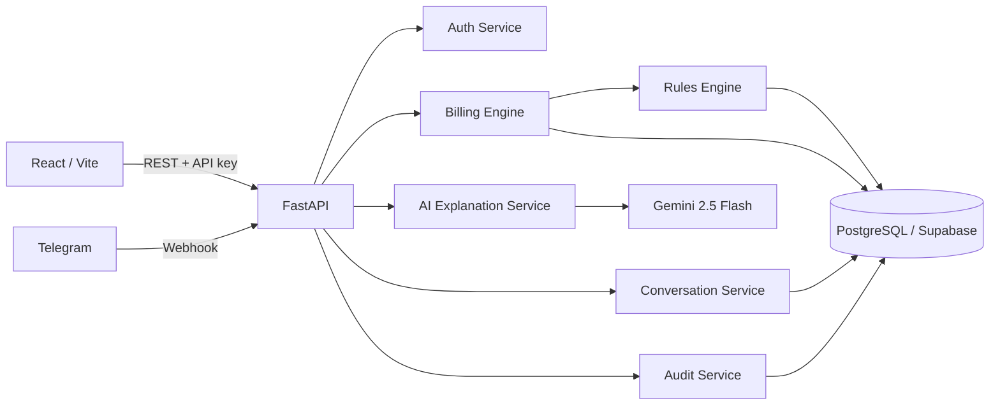
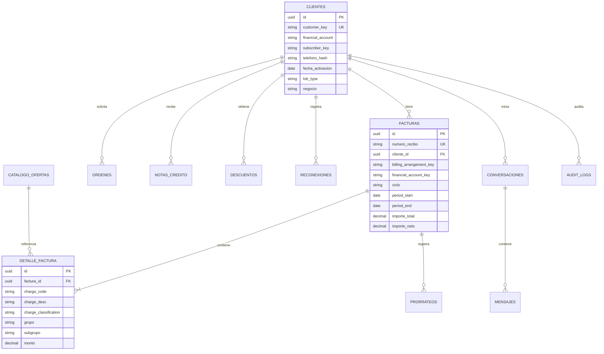

# Arquitectura — ClarIA Movistar

## Decisiones rectoras

ClarIA separa deliberadamente el cálculo financiero de la generación de lenguaje. PostgreSQL es la fuente de verdad; el motor analítico calcula diferencias; el motor de reglas convierte registros verificables en causas; y Gemini solo puede reformular etiquetas ya aprobadas. El render final vuelve a insertar importes desde los objetos calculados, por lo que el modelo nunca escribe cifras financieras.

La primera versión es un monolito modular desplegable (FastAPI) con límites de dominio explícitos. Esta forma reduce complejidad para el hackathon y permite extraer servicios cuando el tráfico o los equipos lo justifiquen.

## Flujo de explicación sin alucinaciones

1. La API autentica la solicitud y usa `customer_key`, nunca DNI o teléfono en claro.
2. Billing Engine carga el recibo actual y hasta cinco ciclos previos.
3. Rules Engine evalúa descuentos, prorrateos, reconexiones, órdenes y notas.
4. Se reconcilia el impacto de las causas con la variación observada. La diferencia no explicada se publica como `OTROS_CARGOS`, basada exclusivamente en el delta agregado de detalle de factura.
5. Gemini recibe IDs y descripciones aprobadas, y solo propone frases sin números.
6. Un validador rechaza frases con cifras, símbolos monetarios o causas no autorizadas.
7. El renderer inserta los importes calculados y la evidencia. Ante cualquier error de IA se usa una redacción determinista.
8. Audit Service registra quién solicitó el análisis, fuentes usadas, causas y latencia, sin PII.

## Límites de módulos

| Módulo | Responsabilidad | No hace |
|---|---|---|
| Auth | Validar API key/Bearer y contexto de actor | Resolver clientes por PII |
| Billing | Seleccionar ciclos, calcular deltas y resumen | Inventar causalidad |
| Rules | Emitir causas desde evidencia persistida | Redactar respuestas libres |
| AI Explainer | Simplificar frases autorizadas | Calcular o modificar importes |
| Conversation | Orquestar preguntas y conservar historial | Alterar facturación |
| Audit | Trazabilidad técnica y funcional | Guardar secretos o teléfono |
| Telegram | Adaptar webhook/canal | Duplicar lógica de negocio |

## Modelo entidad–relación

Las tablas operativas restantes mantienen claves de negocio (`customer_key`, `subscriber_key`, `billing_arrangement`) para poder ingerir extractos de BSS sin acoplarlos a IDs internos. Los índices cubren búsqueda por cliente, recibo, ciclo y fechas.

## API y seguridad

- Todos los endpoints de negocio requieren `X-API-Key` o Bearer; `/health` es público.
- Respuestas y logs excluyen DNI, teléfono y `telefono_hash`.
- CORS es configurable y restrictivo fuera de desarrollo.
- Secretos se cargan por variables de entorno; `.env` no se versiona.
- IDs externos se validan y las consultas se ejecutan mediante SQLAlchemy parametrizado.
- Los webhooks de Telegram validan el secreto configurado.

## Escalabilidad

- **Fase 1:** monolito modular, un PostgreSQL, réplicas stateless de API.
- **Fase 2:** Redis para caché de análisis inmutable por recibo; cola para explicaciones y notificaciones; PgBouncer.
- **Fase 3:** extraer Billing/Rules como servicio de dominio; particionar facturas por ciclo; réplica de lectura.
- **Fase 4:** eventos `invoice.closed` para precalcular causas; observabilidad distribuida; despliegue multirregión.

Los cálculos usan `Decimal`, nunca `float`. Una clave de idempotencia por recibo evita análisis duplicados y el modelo de IA puede degradarse sin afectar la respuesta financiera.
